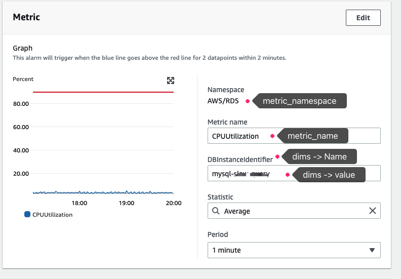

### 用途说明

通过脚本创建CloudWatch告警

### 使用方式
1）调整`set_alarm.py`的 `metric_namespace`,`metric_name`,`alarm_name`, `dims`, `actions`参数
2）在本地安装配置aws命令工具，并配置ak、sk（确保其有cloudwatch操作权限）
3）执行python set_alarm.py 创建告警

注意：`metric_namespace`,`metric_name`、`dims`参数可通过从console创建告警获取

### 参考资料
1. https://docs.aws.amazon.com/AmazonCloudWatch/latest/monitoring/example_cloudwatch_Usage_MetricsAlarms_section.html